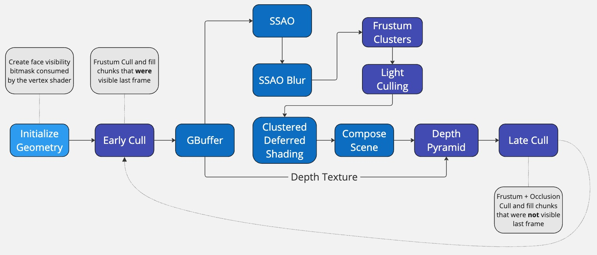

ArXiVision is a Vulkan-based engine designed as a personal playground for exploring computer graphics. It currently focuses on rendering rasterized voxels, with future plans to incorporate cellular automata for terrain generation using voxels. The project aims to achieve visually appealing graphics and optimize performance, while documenting the process to inspire and assist others.

- For more frequent updates you can follow me on <a href="https://twitter.com/Kiiiri7">X</a>.
  
- Demo videos on <a href="https://www.youtube.com/@kiriakosgavras108">YouTube</a>.

### Features
#### Rendering
- [x] Frustum and Hierarchical-Z Occlusion Culling on GPU
- [x] Multi Draw Instanced Indirect Draw with GPU generated commands
- [x] Screen Space Ambient Occlusion (SSAO)
- [ ] Deferred Rendering
- [ ] Shadows

#### General
- [x] Importing .vox format scenes
- [x] Voxelizing .obj models (multithreaded intersection tests)
- [x] Editor (ImGui)

### Render Graph

### Screen Shots
#### Frustum and Hierarchical-Z Occlusion Culling

#### Screen Space Ambient Occlusion

### License
Please adhere to the <a href="https://en.wikipedia.org/wiki/MIT_License">MIT license</a> 