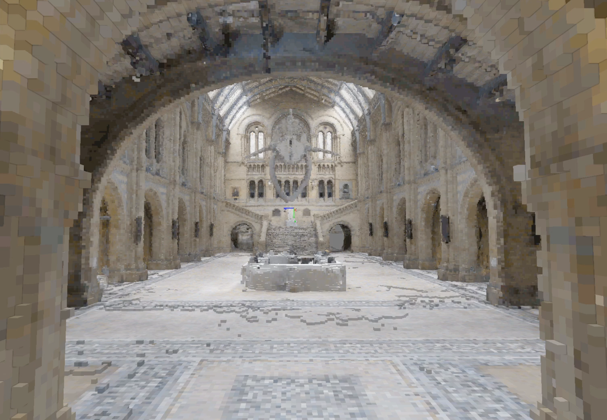
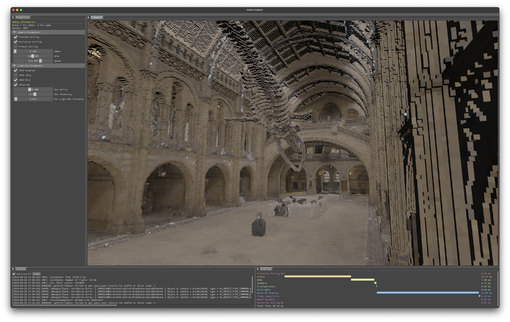

ArXiVision is a **GPU Driven Vulkan Engine** designed as a personal playground for exploring real-time optimization solutions and rendering techniques. It currently renders .vox scenes with rasterizing. There are future plans for non-procedural terrain generation. 

- For more frequent updates you can follow me on <a href="https://twitter.com/Kiiiri7">X</a>.
  
- Demo videos on <a href="https://www.youtube.com/@kiriakosgavras108">YouTube</a>.

### Features
#### Rendering
- [x] Frustum and Hierarchical-Z Occlusion Culling on GPU
- [x] Multi Draw Instanced Indirect Draw with GPU Generated Commands
- [x] Screen Space Ambient Occlusion (SSAO)
- [x] Clustered and Deferred Shaded Area Lights
- [ ] Sky
- [ ] Cascaded Shadows

#### General
- [x] Editor (ImGui)
    * Parameters
    * Console
    * GPU Profiler

### Render Graph


# Media
| Video: Area Lights | Video: Photogrammetry Scene |
|:-:|:-:|
|[](https://www.youtube.com/watch?v=KPrkTDQyz8M) | [](https://twitter.com/Kiiiri7/status/1822658585152676118/video/1)

#### Screenshots



## Build Instructions
### Prerequisites

Before you start, install **CMake** and **glslang**
### Build 
```bash
git clone https://github.com/Qirias/Arxivision
cd Arxivision
chmod +x shaders/compile.sh
```
### Xcode
```bash
chmod +x xcode.sh
./xcode.sh
open xcode_build/ArXiVision.xcodeproj
```

### Standalone (only macOS for now)
```bash
chmod +x general.sh
./general.sh
```

### License
Please adhere to the <a href="https://en.wikipedia.org/wiki/MIT_License">MIT license</a>